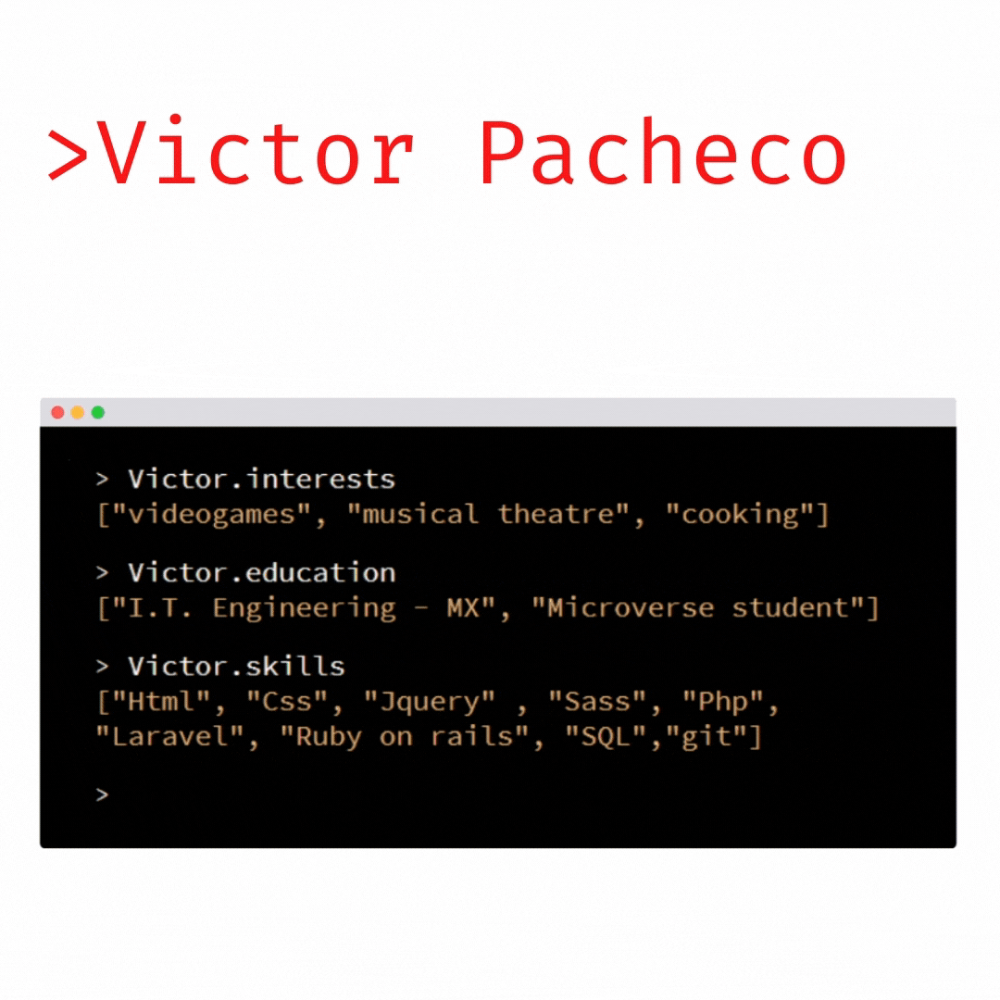

- :man_technologist: I’m a student at [Microverse](https://www.microverse.org/) looking forward to become a Full-Stack Web Developer.

      - Currently learning:
        - [x] HTML & CSS (+ Bootstrap);
        - [x] Ruby; 
        - [x] SQL and Database;
        - [x] Ruby on Rails;
        - [ ] JavaScript;
        - [ ] React & Redux;

- I’m always looking for new challenges and oportunities to colaborate!

  
  

 
  You are visitor number:  
  

    
    
    

<!---->
